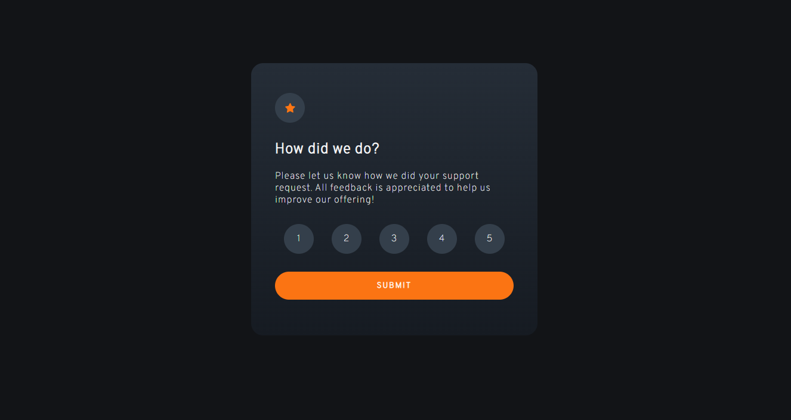

# Frontend Mentor - Interactive rating component solution

This is a solution to the [Interactive rating component challenge on Frontend Mentor](https://www.frontendmentor.io/challenges/interactive-rating-component-koxpeBUmI). Frontend Mentor challenges help you improve your coding skills by building realistic projects. 

## Table of contents

- [Overview](#overview)
  - [The challenge](#the-challenge)
  - [Screenshot](#screenshot)
  - [Links](#links)
- [My process](#my-process)
  - [Built with](#built-with)
  - [What I learned](#what-i-learned)
  - [Continued development](#continued-development)
  - [Useful resources](#useful-resources)
- [Author](#author)
- [Acknowledgments](#acknowledgments)

**Note: Delete this note and update the table of contents based on what sections you keep.**

## Overview

### The challenge

Users should be able to:

- View the optimal layout for the app depending on their device's screen size
- See hover states for all interactive elements on the page
- Select and submit a number rating
- See the "Thank you" card state after submitting a rating

### Screenshot

### Links

- Solution URL: [https://github.com/Miguel-Arturo-Madrigal-Escoto/Interactive-Rating-Component-Solution---FrontEnd-Mentor](https://your-solution-url.com)
- Live Site URL: [https://miguel-arturo-madrigal-escoto.github.io/Interactive-Rating-Component-Solution---FrontEnd-Mentor/](https://your-live-site-url.com)

## My process

### Built with

- Semantic HTML5 markup
- CSS custom properties
- Flexbox
- Vanilla JavaScript

### What I learned

At the end of this challenge, I got more knowledge about web layout and how to use flexbox. I also learned how to use custom properties to style elements. Besides, I practiced more how to manipulate DOM with JavaScript. Now, I feel more comfortable
to complete more challenges with what I learned.

### Continued development

### Useful resources

## Author

- Website - [Miguel Madrigal](https://miguel-arturo-madrigal-escoto.github.io/portafolio/)
- Frontend Mentor - [@2KMiguel64](https://www.frontendmentor.io/profile/Miguel-Arturo-Madrigal-Escoto)

## Acknowledgments

